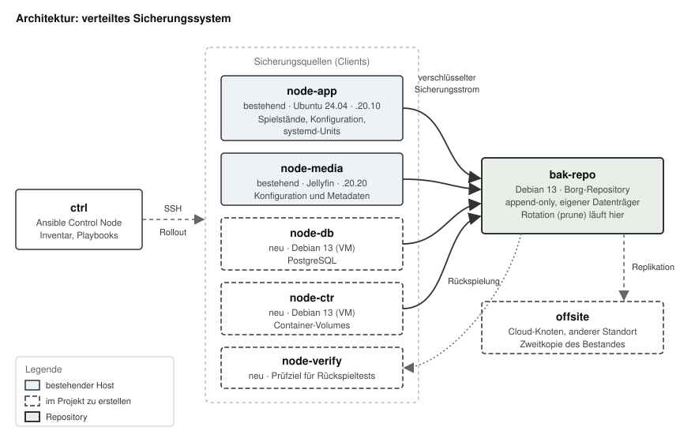

**Arbeitsform:** Einzelarbeit

**Level:** 2 (Ansible mit Debian-VM-Knoten), mit einem Anteil Level 3
(Container-Host `node-ctr`)

# 1. Zielsetzung

Das Projekt spezifiziert ein zentral verwaltetes Sicherungssystem für mehrere
Hosts mit unterschiedlichen Datenquellen: Dateisystemen, einer relationalen
Datenbank und Container-Volumes. Die Konfiguration sämtlicher beteiligter
Knoten erfolgt ausschliesslich über ein Ansible-Inventar. Ein manueller
Eingriff auf einem Zielsystem gilt als Mangel des Systems und nicht als
zulässiger Arbeitsschritt.

Der inhaltliche Schwerpunkt liegt nicht auf dem Erzeugen von Sicherungen,
sondern auf drei Eigenschaften, die eine Sicherung erst brauchbar machen:

1. **Nachgewiesene Wiederherstellbarkeit.** Eine Sicherung, deren Rückspielung
   nicht überprüft wurde, wird als nicht vorhanden betrachtet. Das System
   enthält deshalb einen automatisierten Rückspieltest gegen einen dedizierten
   Prüfknoten.
2. **Konsistenz bei laufendem Betrieb.** Datenbanken und aktive Dienste
   erfordern je eine eigene Strategie, damit der gesicherte Stand in sich
   schlüssig ist. Ein blosses Kopieren von Dateien genügt dafür nicht.
3. **Widerstandsfähigkeit gegen einen kompromittierten Client.** Ein
   Angreifer, der einen gesicherten Host übernimmt, darf bestehende
   Sicherungsstände weder löschen noch verändern können.

Als Sicherungswerkzeug wird Borg eingesetzt. Deduplizierung, Verschlüsselung
und ein Append-only-Modus sind dort Bestandteil des Werkzeugs und müssen nicht
nachgebaut werden. Die Projektarbeit liegt in der Architektur, der
Automatisierung und dem Nachweis der Wiederherstellbarkeit, nicht in der
Installation eines Pakets.

# 2. Ausgangslage

## 2.1 Bestehende Umgebung

| Aspekt | Ist-Zustand |
|---|---|
| Host | HP EliteDesk 800 G1 TWR, Intel Core i7-4770 (4C/8T), 32 GB DDR3 |
| Betriebssystem | Ubuntu 24.04.4 LTS |
| Datenträger | 2x Samsung SSD 840 EVO 250 GB (`sda` System, `sdb` Sicherungen) |
| Dienste | Palworld-Server als `palworld.service`, nächtlicher Neustart über `palworld-restart.timer` |
| Datenvolumen | Serverdateien rund 10 GB, veränderliche Daten unter `Pal/Saved/` |
| Netz | `192.168.20.10/24`, Gateway und Firewall FortiGate 40F |
| Zweiter Host | Mediaserver (Jellyfin) unter `192.168.20.20`, eigenes Gerät |

## 2.2 Bestehende Sicherung und ihre Mängel

Auf `node-app` läuft ein Bash-Skript, das die Spielstände alle sechs Stunden
in ein Archiv packt und Archive älter als 14 Tage entfernt. Ziel ist die
zweite lokale SSD unter `/mnt/backup`.

Daraus ergeben sich die Anforderungen dieses Projekts:

| Mangel | Folge |
|---|---|
| Nur ein Host abgedeckt | Der Mediaserver ist ungesichert |
| Ziel liegt im selben Gehäuse | Netzteil-, Diebstahl- oder Brandschaden trifft Daten und Sicherung gleichzeitig |
| Aufbewahrung nur nach Alter | Kein Schutz vor einem Fehler, der länger als 14 Tage unbemerkt bleibt |
| Client darf im Ziel löschen | Schadsoftware auf dem Host erreicht auch die Sicherungen |
| Keine Prüfung der Rückspielung | Ob die Archive brauchbar sind, ist unbekannt |
| Keine Rückmeldung bei Fehlschlag | Ein stillstehender Sicherungslauf fällt nicht auf |
| Kein Deduplizieren, keine Verschlüsselung | Platzbedarf wächst linear, Archive sind im Klartext lesbar |

## 2.3 Vorbedingungen

Bis auf den Knoten der Zweitkopie werden die neuen Knoten als virtuelle
Maschinen mit KVM/libvirt auf `node-app` betrieben. Bei 32 GB Arbeitsspeicher und einem Bedarf des bestehenden Dienstes
von 6 bis 10 GB stehen dafür ausreichend Mittel bereit. Je Knoten sind 2 GB
Arbeitsspeicher und 12 GB Plattenplatz vorgesehen. Der Repository-Knoten
erhält den Datenträger `sdb` durchgereicht und übernimmt damit die Rolle der
bisherigen Sicherungsplatte.

Die bestehenden Dienste bleiben während des gesamten Projekts in Betrieb. Sie
sind kein Laboraufbau, sondern werden tatsächlich genutzt. Ein Ausfall durch
Arbeiten am Sicherungssystem ist nicht zulässig.

# 3. Architektur

## 3.1 Knoten und Rollen

| Knoten | Zustand | Rolle |
|---|---|---|
| `ctrl` | neu | Ansible Control Node, Inventar und Playbooks |
| `node-app` | bestehend | Client: Dateisystem, laufender Dienst |
| `node-media` | bestehend | Client: Konfiguration und Metadaten des Mediendienstes |
| `node-db` | neu (VM) | Client: PostgreSQL |
| `node-ctr` | neu (VM) | Client: Container-Volumes |
| `node-verify` | neu (VM) | Prüfziel für automatisierte Rückspieltests |
| `bak-repo` | neu (VM) | Repository-Server, Rotation, Append-only-Durchsetzung |
| `offsite` | neu (Cloud) | Zweitkopie des Repository-Bestandes an anderem Standort |

## 3.2 Schema

Der Steuerknoten spricht ausschliesslich konfigurierend mit den übrigen
Knoten. Er ist am eigentlichen Sicherungsvorgang nicht beteiligt und kann
ausgeschaltet sein, ohne dass Sicherungen ausfallen. Die Clients übertragen
ihren Sicherungsstrom direkt zum Repository. Die Rückspielung erfolgt in die
Gegenrichtung auf einen getrennten Prüfknoten, damit ein Test niemals
Produktivdaten überschreiben kann.

## 3.3 Trennung der Berechtigungen

Jeder Client erhält einen eigenen SSH-Schlüssel und einen eigenen
Unterbereich im Repository. Der Zugang ist auf dem Repository-Server auf einen
einzelnen Befehl eingeschränkt und im Append-only-Modus betrieben. Das
Entfernen alter Stände nach der Aufbewahrungsregel geschieht deshalb nicht
durch den Client, sondern durch einen Vorgang auf dem Repository-Server
selbst.

## 3.4 Aufbewahrungsregel

| Stufe | Anzahl | Begründung |
|---|---|---|
| stündlich | 12 | Spielstände ändern sich laufend, der Verlust eines Spielabends soll vermeidbar bleiben |
| täglich | 7 | Deckt eine Woche vollständig ab |
| wöchentlich | 4 | Erfasst Fehler, die erst nach Tagen auffallen |
| monatlich | 6 | Deckt schleichende Fehler und versehentliche Löschungen ab, die lange unbemerkt bleiben |

Die bisherige Regel, also alles der letzten 14 Tage und danach nichts, wird
damit ersetzt: gleiche Abdeckung in der jüngsten Vergangenheit, deutlich
längere Reichweite bei geringerem Platzbedarf.

## 3.5 Zielwerte

Die folgenden Werte gelten als Vorgabe, gegen die im Testkonzept gemessen
wird. Ohne solche Vorgaben wäre eine gemessene Zeit nur eine Zahl und kein
Kriterium.

| Grösse | Quelle | Vorgabe |
|---|---|---|
| Maximaler Datenverlust | Spielstände auf `node-app` | höchstens 1 Stunde |
| Maximaler Datenverlust | übrige Quellen | höchstens 24 Stunden |
| Wiederherstellungsdauer | Spieldienst vollständig nutzbar | höchstens 60 Minuten |
| Wiederherstellungsdauer | einzelne Datei | höchstens 5 Minuten |
| Unterbrechung im Betrieb | Spieldienst je Sicherungslauf | höchstens 60 Sekunden |

# 4. Funktionsumfang

**F1 Ausrollen über das Inventar.** Ein einzelner Playbook-Aufruf konfiguriert
jeden im Inventar aufgeführten Client vollständig: Werkzeug, Schlüsselmaterial,
Repository-Zugang, Auswahl der zu sichernden Pfade und Zeitsteuerung. Ein neu
ins Inventar aufgenommener Host ist nach einem Lauf ohne weitere Handgriffe
gesichert.

**F2 Idempotenz.** Ein wiederholter Lauf ohne zwischenzeitliche Änderung
verändert nichts am Zielsystem.

**F3 Rollen je Quellenart.** Die drei Quellenarten Dateisystem, Datenbank und
Container-Volume sind als getrennte Ansible-Rollen umgesetzt. Ein Host kann
mehrere davon tragen.

**F4 Konsistente Datenbanksicherung.** Der gesicherte Datenbankstand ist in
sich schlüssig. Schreibvorgänge während des Sicherungslaufs führen nicht zu
einem teilweise erfassten Zustand.

**F5 Konsistente Sicherung laufender Dienste.** Für Dienste mit veränderlichen
Dateien wird vor der Sicherung ein definierter Ruhepunkt hergestellt und
danach wieder aufgehoben. Die Unterbrechung bleibt innerhalb der Vorgabe aus
Abschnitt 3.5.

**F6 Verschlüsselung.** Der Repository-Inhalt ist ohne den zugehörigen
Schlüssel nicht auswertbar. Das Schlüsselmaterial liegt nicht im Klartext auf
den Clients.

**F7 Append-only.** Ein Client kann bestehende Sicherungsstände weder löschen
noch verändern. Ein Versuch schlägt fehl und wird auf dem Repository-Server
protokolliert.

**F8 Rotation.** Die Aufbewahrungsregel aus Abschnitt 3.4 wird auf dem
Repository-Server durchgesetzt, unabhängig davon, ob ein Client erreichbar
ist.

**F9 Automatisierter Rückspieltest.** In festem Abstand wird ein
Sicherungsstand selbsttätig auf `node-verify` zurückgespielt und der
zurückgespielte Inhalt gegen eine Prüfsumme verglichen. Das Ergebnis wird
festgehalten.

**F10 Überwachung.** Erfolg oder Misserfolg jedes Laufs ist zentral ablesbar.
Bleibt ein erwarteter Lauf aus oder schlägt er fehl, wird innerhalb von 30
Minuten eine Meldung ausgelöst. Ausbleiben und Fehlschlag werden
unterschieden.

**F11 Dokumentierte Wiederherstellungsprozedur.** Für jede Quellenart
existiert eine schriftliche Anleitung, mit der eine dritte Person ohne
Kenntnis des Aufbaus den Dienst wiederherstellen kann.

**F12 Zweitkopie an anderem Standort.** Der Repository-Bestand wird
selbsttätig auf einen Cloud-Knoten repliziert, der ausserhalb des eigenen
Netzes liegt. Der Knoten wird über die Kommandozeile des Anbieters erzeugt und
anschliessend wie jeder andere Knoten über das Inventar konfiguriert.

**F13 Einhaltung der Zielwerte.** Die Vorgaben aus Abschnitt 3.5 zu
Datenverlust, Wiederherstellungsdauer und Betriebsunterbrechung werden
eingehalten und sind belegt.

# 5. Testkonzept

Jeder Test benennt Vorgehen und Erfolgskriterium. Die Kriterien sind so
gefasst, dass die Prüfung eindeutig bestanden oder nicht bestanden ergibt.

| Merkmal | F1 | F2 | F3 | F4 | F5 | F6 | F7 | F8 | F9 | F10 | F11 | F12 | F13 |
|---|---|---|---|---|---|---|---|---|---|---|---|---|---|
| geprüft durch | T1, T3 | T2 | T1 | T4 | T5 | T7 | T6 | T8 | T9 | T10 | T11 | T12 | T13 |

**T1 Ausrollen auf unbekanntem Host** (F1, F3)

*Vorgehen:* Einen leeren Debian-Knoten ins Inventar aufnehmen und das Playbook
ausführen.
*Erfolg:* Ohne weiteren Eingriff auf dem Zielsystem läuft anschliessend eine
planmässige Sicherung, und der erzeugte Stand ist im Repository auffindbar.

**T2 Idempotenz** (F2)

*Vorgehen:* Das Playbook zweimal hintereinander ausführen.
*Erfolg:* Der zweite Lauf meldet null geänderte und null fehlgeschlagene
Aufgaben.

**T3 Rückspielung mit Integritätsnachweis** (F1, F11)

*Vorgehen:* Eine Datei bekannten Inhalts anlegen, Prüfsumme festhalten,
Sicherung auslösen, Datei löschen, aus dem Repository zurückspielen, Prüfsumme
erneut bilden.
*Erfolg:* Die Prüfsummen stimmen überein, und die benötigte Zeit liegt
innerhalb der Vorgabe für eine einzelne Datei aus Abschnitt 3.5.

**T4 Datenbankkonsistenz unter Last** (F4)

*Vorgehen:* Während des Sicherungslaufs eine fortlaufende Schreiblast auf die
Datenbank geben, anschliessend den Stand auf `node-verify` zurückspielen.
*Erfolg:* Die zurückgespielte Datenbank startet ohne Wiederherstellungsfehler,
die Integritätsprüfung meldet keine Beanstandung, und der Datenbestand
entspricht einem einzelnen Zeitpunkt statt einer Mischung mehrerer.

**T5 Ruhepunkt bei laufendem Dienst** (F5)

*Vorgehen:* Sicherungslauf auf `node-app` bei laufendem Spieleserver auslösen
und die Unterbrechung messen.
*Erfolg:* Der Dienst ist danach ohne manuellen Eingriff wieder verfügbar, die
Unterbrechung bleibt innerhalb der Vorgabe aus Abschnitt 3.5, und der
gesicherte Spielstand lässt sich fehlerfrei laden.

**T6 Wirksamkeit des Löschschutzes** (F7)

*Vorgehen:* Vom Client aus mit dessen regulärem Zugang versuchen, einen
bestehenden Stand zu entfernen, anschliessend versuchen, einen bestehenden
Stand zu überschreiben.
*Erfolg:* Beide Versuche scheitern, die Bestände bleiben unverändert, und
beide Versuche erscheinen im Protokoll des Repository-Servers.

**T7 Verschlüsselung** (F6)

*Vorgehen:* Auf dem Repository-Server ohne Schlüssel versuchen, den Inhalt
eines Standes aufzulisten und eine bekannte Zeichenkette in den Rohdateien zu
suchen.
*Erfolg:* Das Auflisten scheitert, und die Zeichenkette ist in den Rohdateien
nicht auffindbar.

**T8 Rotation** (F8)

*Vorgehen:* Eine Reihe von Ständen mit künstlich gesetzten Zeitstempeln über
mehrere Monate erzeugen und die Aufbewahrungsregel anwenden.
*Erfolg:* Die verbleibende Anzahl und zeitliche Verteilung entspricht exakt
der Vorgabe aus Abschnitt 3.4. Ein Lauf bei abgeschaltetem Client führt zum
gleichen Ergebnis.

**T9 Automatisierter Rückspieltest** (F9)

*Vorgehen:* Den Prüfvorgang auslösen, danach absichtlich einen Stand im
Repository beschädigen und erneut auslösen.
*Erfolg:* Der erste Durchgang wird als bestanden, der zweite als nicht
bestanden vermerkt. Ein stillschweigendes Bestehen bei beschädigtem Stand gilt
als Fehlschlag des Tests.

**T10 Überwachung bei Fehlschlag und Ausbleiben** (F10)

*Vorgehen:* Erstens einen Lauf gezielt scheitern lassen. Zweitens die
Zeitsteuerung auf einem Client abschalten und die erwartete Zeit verstreichen
lassen.
*Erfolg:* In beiden Fällen erscheint innerhalb von 30 Minuten eine Meldung,
und die beiden Fälle sind daran unterscheidbar.

**T11 Wiederherstellung durch eine dritte Person** (F11)

*Vorgehen:* Eine mit dem Aufbau nicht vertraute Person stellt allein anhand
der schriftlichen Anleitung einen Dienst auf `node-verify` wieder her.
*Erfolg:* Die Wiederherstellung gelingt ohne Rückfragen. Jede nötige Rückfrage
wird als Lücke in der Anleitung erfasst und behoben.

**T12 Ausfall des Repository-Servers** (F12)

*Vorgehen:* Den Repository-Knoten abschalten und aus der Zweitkopie einen
Stand zurückspielen.
*Erfolg:* Die Rückspielung gelingt allein aus der Zweitkopie. Die dafür
benötigte Zeit wird protokolliert.

**T13 Einhaltung der Zielwerte** (F13)

*Vorgehen:* Den Spieldienst auf `node-verify` vollständig aus einem
Sicherungsstand herstellen und die Zeit vom Beginn bis zur Nutzbarkeit messen.
Zusätzlich für jede Quelle den Abstand zwischen dem jüngsten vorhandenen Stand
und dem Zeitpunkt der Messung bestimmen.
*Erfolg:* Alle gemessenen Werte liegen innerhalb der Vorgaben aus Abschnitt
3.5. Überschreitungen werden mit Ursache festgehalten.

# 6. Abgrenzung

Nicht Gegenstand dieses Projekts sind:

**Hochverfügbarkeit.** Es geht um Wiederherstellbarkeit nach einem Verlust,
nicht um unterbrechungsfreien Betrieb. Ein Ausfall mit anschliessender
Rückspielung ist ein zulässiges Ergebnis.

**Sicherung der Betriebssysteme selbst.** Gesichert werden Daten und
Konfiguration. Die Knoten sind über Ansible reproduzierbar. Ein Abbild des
gesamten Systems wäre der schlechtere Weg zum selben Ziel.

**Grafische Oberfläche.** Bedienung und Auswertung erfolgen über Kommandozeile
und Protokolle.

**Weitere Datenbanksysteme.** PostgreSQL steht stellvertretend für die
Quellenart. Die Rolle ist so aufgebaut, dass ein weiteres System ergänzt
werden könnte, umgesetzt wird es nicht.

# 7. Offene Punkte und Einschränkungen

**Laufende Kosten der Zweitkopie.** Der Cloud-Knoten aus F12 verursacht als
einzige Komponente wiederkehrende Kosten. Sie liegen im Bereich weniger
Franken im Monat und werden als Voraussetzung des Projekts akzeptiert. Der
Knoten erhält ausschliesslich verschlüsselte Daten, der Anbieter kann den
Inhalt nicht auswerten (F6).

**Gemeinsame Hardware.** Die Knoten `node-db`, `node-ctr`, `node-verify` und
`bak-repo` laufen als virtuelle Maschinen auf `node-app`. Ein Ausfall dieses
Geräts trifft damit Quelle und Repository zugleich. Genau deshalb ist die
Zweitkopie an einem anderen Standort kein Zusatz, sondern tragender
Bestandteil der Architektur.

**Alter der Datenträger.** Beide SSDs stammen von 2013 und laufen mit der
Auslieferungs-Firmware, deren bekannter Fehler die Leseraten lange
unveränderter Daten beeinträchtigt. Für ein Sicherungsziel, auf dem Daten über
Monate unangetastet liegen, ist das ein Risiko. Die regelmässige
Integritätsprüfung des Repository-Bestands deckt daraus entstehende Schäden
auf, die Zweitkopie begrenzt die Folgen.

**Wahl der Konsistenzverfahren.** Welches Verfahren je Quellenart den besten
Kompromiss zwischen Konsistenz und Betriebsunterbrechung bietet, wird zu
Beginn der Umsetzung untersucht und erst danach festgelegt. Für die
Datenbank kommen ein logischer Auszug oder eine Sicherung auf Dateiebene mit
Transaktionsprotokoll in Frage, für Container-Volumes ein kurzes Anhalten oder
eine Momentaufnahme auf Dateisystemebene.

# 8. Umsetzungsschritte

1. Steuerknoten und Inventar aufsetzen, Zugang zu allen bestehenden Hosts
   herstellen.
2. Virtuelle Knoten erzeugen, Erzeugung und Grundkonfiguration automatisieren.
3. Konsistenzverfahren je Quellenart untersuchen und festlegen (Abschnitt 7).
4. Repository-Knoten einrichten, Zugangstrennung und Append-only umsetzen
   (F6, F7), geprüft mit T6 und T7.
5. Rolle Dateisystem, zuerst gegen `node-media` als unkritische Quelle
   (F1, F2), geprüft mit T1, T2, T3.
6. Rolle Dateisystem auf `node-app` erweitern, Ruhepunkt für den laufenden
   Dienst (F5), geprüft mit T5. Die bisherige Sicherung bleibt bis zum
   bestandenen Test aktiv.
7. Rolle Datenbank (F4), geprüft mit T4.
8. Rolle Container-Volumes (F3), geprüft mit T3 gegen diese Quellenart.
9. Rotation auf dem Repository-Server (F8), geprüft mit T8.
10. Automatisierter Rückspieltest (F9), geprüft mit T9.
11. Überwachung (F10), geprüft mit T10.
12. Cloud-Knoten über die Kommandozeile des Anbieters erzeugen, in das
    Inventar aufnehmen und Replikation einrichten (F12), geprüft mit T12.
13. Wiederherstellungsanleitungen verfassen (F11), geprüft mit T11.
14. Abschluss: Zielwerte messen (F13, T13), bisherige Sicherung ausser Betrieb
    nehmen, Ergebnisse und Messwerte zusammenstellen.

Die Reihenfolge folgt zwei Grundsätzen: Der Schutz des Repositorys steht vor
dem ersten Datenstrom, und jede Quellenart wird erst dann auf einer
produktiven Quelle eingesetzt, wenn sie an einer unkritischen erprobt wurde.
